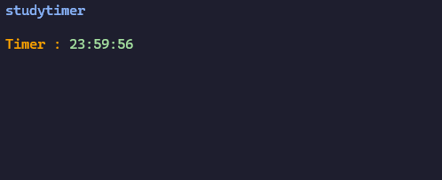

# studytimer


A lightweight study timer built with Python, running in the terminal with a built-in audible alarm and low resource usage.



## Features

* Countdown timer for study sessions
* Supports study sessions up to 24 hours
* Audible alarm when the timer reaches zero
* Lightweight and works well on devices with limited resources

## Supported Platforms

- Windows
- Linux
- macOS

## Requirements

* Python 3.10 or later
* miniaudio
* Terminal with ANSI escape sequence support

## Installation

### Clone the repository :

```bash
git clone https://github.com/MohssineX/studytimer.git
cd studytimer
```

### Install dependencies :

```bash
pip install -r requirements.txt
```

Or

```bash
pip install miniaudio
```

## Usage

Run the program :

```bash
python studytimer.py
```

If your system uses `python3` :

```bash
python3 studytimer.py
```
## License

This project is licensed under the **MIT License**.

---

## Author

**Mohssine :**
[ https://github.com/MohssineX](https://github.com/MohssineX)

---

## 🐱 Special Thanks

A special thanks to mimi — the legendary, the great, the gentle cat.

---

### If you like it, give it a star :)
